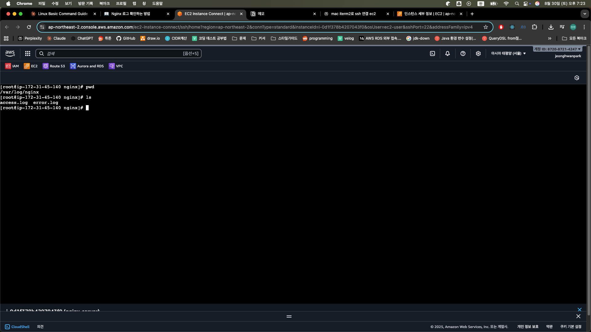

### 리눅스 환경에서 설치

```bash
# 패키지 리스트 업데이트
sudo yum update  # CentOS 7
# 또는
sudo dnf update  # CentOS 8, RHEL 8

# 필요한 패키지 설치
sudo yum install curl gnupg2 ca-certificates
# 또는
sudo dnf install curl gnupg2 ca-certificates

# nginx 공식 저장소 추가
sudo rpm --import https://nginx.org/keys/nginx_signing.key

# nginx.repo 파일 생성
sudo tee /etc/yum.repos.d/nginx.repo > /dev/null <<EOF
[nginx-stable]
name=nginx stable repo
baseurl=http://nginx.org/packages/centos/\$releasever/\$basearch/
gpgcheck=1
enabled=1
gpgkey=https://nginx.org/keys/nginx_signing.key
module_hotfixes=true
EOF

# nginx 설치
sudo yum install nginx
# 또는
sudo dnf install nginx
```


### Nginx 실행하기

```bash
# nginx 상태 확인
$ sudo systemctl status nginx

# nginx 시작
$ sudo systemctl start nginx

# nginx 서비스 중지 
$ sudo systemctl stop nginx
```

### $ sudo systemctl status nginx

```
sudo systemctl status nginx
○ nginx.service - The nginx HTTP and reverse proxy server
     Loaded: loaded (/usr/lib/systemd/system/nginx.service; disabled; preset: disabled)
     Active: inactive (dead) //실행 안하고 있음
```

### $ sudo systemctl start nginx
실행 후 상태 확인
```
$ sudo systemctl status nginx
● nginx.service - The nginx HTTP and reverse proxy server
     Loaded: loaded (/usr/lib/systemd/system/nginx.service; disabled; preset: disabled)
     Active: active (running) since Fri 2025-08-29 23:41:30 UTC; 34s ago
    Process: 27546 ExecStartPre=/usr/bin/rm -f /run/nginx.pid (code=exited, status=0/SUCCESS)
    Process: 27548 ExecStartPre=/usr/sbin/nginx -t (code=exited, status=0/SUCCESS)
    Process: 27559 ExecStart=/usr/sbin/nginx (code=exited, status=0/SUCCESS)
   Main PID: 27577 (nginx)
      Tasks: 2 (limit: 1111)
     Memory: 2.5M
        CPU: 57ms
     CGroup: /system.slice/nginx.service
             ├─27577 "nginx: master process /usr/sbin/nginx"
             └─27580 "nginx: worker process"
```

### **1. tee**

bash

`tee filename  *# 입력받은 내용을 파일에 저장하면서 동시에 표준출력으로도 출력*`

- 파이프로 받은 데이터를 **파일에 저장 + 화면 출력**을 동시에 수행
- `echo "hello" | tee file.txt` → "hello"를 file.txt에 저장하면서 화면에도 출력

**tee의 특별한 장점:**

```bash
*# 이렇게 하면 권한 오류 발생*
echo "content" > /etc/system-file  *# 권한 없어서 실패# 이것도 마찬가지로 실패 (sudo가 echo에만 적용됨)*
sudo echo "content" > /etc/system-file

*# 올바른 방법 (tee 사용)*
echo "content" | sudo tee /etc/system-file  *# 성공!*
```

### **2. /etc/yum.repos.d/nginx.repo**

```bash
/etc/yum.repos.d/nginx.repo  *# 생성될 파일의 전체 경로*
```

- `/etc/yum.repos.d/`: yum 패키지 관리자의 저장소 설정 디렉토리
- `nginx.repo`: nginx 저장소 정보를 담을 파일명
- `.repo` 확장자는 yum이 자동으로 인식하는 저장소 설정 파일

### **3. > /dev/null**

```bash
> /dev/null  *# 표준출력을 버리기(무시하기)*
```

- `tee`는 기본적으로 파일 저장 + 화면 출력을 동시에 함
- `> /dev/null`로 화면 출력 부분을 버림 (파일 저장만 수행)
- `/dev/null`: 리눅스의 "쓰레기통" 같은 특수 파일

### **4. <<EOF**

```bash
<<EOF  *# Here Document (히어 도큐먼트) 시작*
```

- 여러 줄의 텍스트를 입력으로 전달하는 방법
- `EOF`까지의 모든 내용을 명령어의 입력으로 사용
- `EOF` 대신 다른 구분자도 사용 가능 (예: `<<END`, `<<FINISH`)

### Nginx 로그 확인하는 방법

Spring Boot 또는 Nest.js와 같은 프레임워크를 활용해서 개발할 때 **콘솔창**을 자주 확인한다.

콘솔창을 보면서 에러 메시지가 뜨는 지, 잘 작동하는 지 확인하면서 개발 작업을 한다. 리눅스에서 콘솔창 역할을 하는 게 바로 **로그 파일**이다. 로그 파일을 통해서 Nginx가 잘 실행됐는 지, 에러가 발생한건 아닌 지, 에러가 발생했다면 어떤 에러가 발생했는 지 확인할 수 있다. 따라서 어떤 프로그램을 사용하든 간에 로그 확인하는 방법을 알아두는 게 중요하다.
  

### **Nginx 로그 확인하는 방법**

  

Nginx의 로그 파일 위치는 /var/log/nginx/이다. 이 경로로 이동하면 access.log와 error.log 파일이 있다. access.log 파일에는 Nginx 서버로 접근한 요청에 대한 정보가 기록으로 남아있고, error.log 파일에는 에러 메시지에 대한 내용이 담겨있다.

# Nginx 로그 파일이 위치한 곳으로 이동

```bash
$ cd /var/log/nginx

# 파일의 마지막 10줄을 출력
$ tail access.log
$ tail error.log
```

실시간으로 access.log가 쌓이는 걸 눈으로 확인해보자.

# 파일의 마지막 10줄을 출력 + 실시간으로 파일에 추가되는 내용을 출력
$ tail -f access.log


## React + Vite 배포하기

### **1. React 프로젝트를 EC2로 가져오기**

```bash
$ cd /usr/share/nginx
$ sudo git clone https://github.com/joung1010/nginx-basic-react.git
```

**클론 후 프로젝트 구조 확인:**

```bash
ls -la /usr/share/nginx/nginx-basic-react/
```

bash

```bash
 *# 예상 구조*
nginx-basic-react/
├── package.json
├── vite.config.js
├── index.html
├── src/
│   ├── App.jsx
│   ├── main.jsx
│   └── components/
├── public/
│   └── favicon.ico
└── dist/              *# 빌드 후 생성될 디렉토리*
```

### **2. React 프로젝트 빌드를 위해 Node.js 설치하기**

### **Amazon Linux 2023 기준 설치:**

```bash
*# 1. 시스템 업데이트*
sudo dnf update -y

*# 2. 기본 저장소에서 Node.js 설치 시도*
sudo dnf install nodejs npm -y

*# 3. 버전 확인*
node --version
npm --version
```

### **최신 Node.js 20 설치 (권장):**

```bash
*# 4. Node.js 20 LTS 설치*
curl -fsSL https://rpm.nodesource.com/setup_20.x | sudo bash -
sudo yum install -y nodejs

*# Node.js가 잘 설치됐는지 확인하기*
node -v
npm -v
```

**예상 출력:**

```bash
$ node -v
v20.11.1

$ npm -v  
10.2.4
```

### **Ubuntu/Debian 계열인 경우:**

```bash
curl -fsSL https://deb.nodesource.com/setup_20.x | sudo -E bash -
sudo apt-get install -y nodejs
```

### **3. React 프로젝트 빌드하기**

```bash
 $ cd nginx-basic-react
$ sudo npm i
$ sudo npm run build
```

### **🔧 빌드 과정 상세 분석**

**npm install 과정:**

```bash
*# package.json 확인*
cat package.json
```

```bash
{
  "name": "nginx-basic-react",
  "scripts": {
    "dev": "vite",
    "build": "vite build",
    "preview": "vite preview"
  },
  "dependencies": {
    "react": "^18.2.0",
    "react-dom": "^18.2.0"
  },
  "devDependencies": {
    "vite": "^5.0.0",
    "@vitejs/plugin-react": "^4.2.1"
  }
}
```

**빌드 실행:**

```bash
sudo npm run build
```

**빌드 성공 시 출력 예시:**

```bash
> nginx-basic-react@1.0.0 build
> vite build

✓ building for production...
✓ built in 1.23s
dist/
├── index.html
├── assets/
│   ├── index-[hash].js     *# 번들된 JavaScript*
│   └── index-[hash].css    *# 번들된 CSS*
└── favicon.ico
```

**⚠️ 중요:** Vite는 빌드 결과물을 **`dist`** 디렉토리에 생성하지만, Create React App은 **`build`** 디렉토리에 생성합니다!

**빌드 디렉토리 확인:**

```bash
ls -la /usr/share/nginx/nginx-basic-react/
```

**Vite 프로젝트라면:**

```bash
/usr/share/nginx/nginx-basic-react/
├── dist/           *# 👈 Vite 빌드 결과물*
│   ├── index.html
│   └── assets/
├── src/
└── package.json
```

### **4. Nginx 설정 파일 수정하기**

### **설정 파일 수정:**

```bash
cd /etc/nginx/conf.d
sudo vi default.conf

*# default.conf가 없다면:*
sudo vi /etc/nginx/conf.d/react-app.conf
```

### **Vite 프로젝트용 설정:**

```bash
server {
    listen       80; 
    server_name  localhost;

    *# 🔧 React 앱 루트 설정 (Vite는 dist 디렉토리 사용!)*
    location / {
        root   /usr/share/nginx/nginx-basic-react/dist;    *# Vite: dist 디렉토리*
        index  index.html;
        
        *# 🚀 SPA 라우팅 지원 (React Router용)*
        try_files $uri $uri/ /index.html;
    }
    
    *# 🎨 정적 에셋 최적화*
    location /assets/ {
        root   /usr/share/nginx/nginx-basic-react/dist;
        expires 1y;
        add_header Cache-Control "public, immutable";
        access_log off;
    }
    
    *# 🔒 보안 헤더 (React 앱용)*
    add_header X-Frame-Options "DENY" always;
    add_header X-Content-Type-Options "nosniff" always;
    add_header X-XSS-Protection "1; mode=block" always;
    add_header Referrer-Policy "strict-origin-when-cross-origin" always;

    *# 🚨 에러 페이지 설정*
    error_page   500 502 503 504  /50x.html;
    location = /50x.html {
        root   /usr/share/nginx/html;
    }
}
```

### **Create React App인 경우:**

```bash
location / {
    root   /usr/share/nginx/nginx-basic-react/build;    *# CRA: build 디렉토리*
    index  index.html;
    try_files $uri $uri/ /index.html;
}
```

### **5. 파일 권한 설정**

```bash
*# 빌드된 파일들의 권한 설정*
sudo chown -R nginx:nginx /usr/share/nginx/nginx-basic-react/dist/
sudo chmod -R 755 /usr/share/nginx/nginx-basic-react/dist/
```

### **6. 설정 반영하기**

```bash
*# Nginx 설정 파일 중 문법 에러가 있는지 체크*
sudo nginx -t

*# Nginx의 설정 파일이 바뀐 경우 아래 명령어를 입력해줘야 설정 파일이 반영된다.*
sudo nginx -s reload
```

### **7. 웹 페이지 접속해보기**

### **로컬 테스트:**

```bash
 *# HTML 내용 확인*
curl http://localhost/

*# React 앱의 정적 파일들 확인*
curl -I http://localhost/assets/index-*.js
curl -I http://localhost/assets/index-*.css
```

### **브라우저 접속:**

```bash
*# EC2 퍼블릭 IP 확인*
curl http://169.254.169.254/latest/meta-data/public-ipv4

*# 브라우저에서: http://[EC2-PUBLIC-IP]/*
```

## Next.js + Nginx 정적 배포하기

### **1. Next.js 프로젝트를 EC2로 가져오기**

```bash
cd /usr/share/nginx
sudo git clone https://github.com/joung1010/nginx-basic-nextjs.git
```

### **2. Next.js 프로젝트 빌드하기**

bash

```bash
$ cd nginx-basic-nextjs
$ sudo npm i
$ sudo npm run build
```

bash

### **⚠️ 중요: Next.js 정적 내보내기 설정**

**next.config.mjs**

```jsx
*/** @type {import('next').NextConfig} */*
const nextConfig = {
  output: 'export'    *// 정적 파일로 내보내기 활성화*
};

export default nextConfig;
```

**이 설정이 중요한 이유:**

- **기본 Next.js**: 서버 사이드 렌더링(SSR) 기반 → Node.js 서버 필요
- **output: 'export'**: 모든 페이지를 정적 HTML로 pre-render → Nginx만으로 배포 가능

**성공 시 출력 예시:**

bash

```jsx
> nginx-basic-nextjs@1.0.0 build
> next build

✓ Creating an optimized production build
✓ Compiled successfully
✓ Collecting page data
✓ Finalizing page optimization

Route (pages)                              Size     First Load JS
┌ ○ /                                      1.2 kB          87.2 kB
├ ○ /about                                 891 B           86.9 kB
└ ○ /404                                   194 B           86.1 kB

○  (Static)  automatically rendered as static HTML
```

### **3. Nginx 설정 파일 수정하기**

```bash
$ cd /etc/nginx/conf.d
$ sudo vi default.conf

*# default.conf가 없다면:*
$ sudo vi /etc/nginx/conf.d/nextjs-app.conf
```

### **Next.js 정적 배포용 Nginx 설정:**

```bash
server {
    listen       80; 
    server_name  localhost;

    *# 🚀 Next.js 정적 파일 서빙*
    location / {
        root   /usr/share/nginx/nginx-basic-nextjs/out;    *# Next.js는 out 디렉토리!*
        index  index.html;
        
        *# 🎯 SPA 라우팅 지원 (Next.js Router용)*
        try_files $uri $uri.html $uri/ /index.html;
    }
    
    *# 🚀 Next.js 정적 에셋 최적화*
    location /_next/static/ {
        root   /usr/share/nginx/nginx-basic-nextjs/out;
        expires 1y;
        add_header Cache-Control "public, immutable";
        access_log off;
    }
    
    *# 🖼️ 이미지 파일 최적화*
    location ~* \.(png|jpg|jpeg|gif|ico|svg|webp)$ {
        root   /usr/share/nginx/nginx-basic-nextjs/out;
        expires 1y;
        add_header Cache-Control "public, immutable";
        access_log off;
    }

    *# 🚨 에러 페이지 설정*
    error_page   500 502 503 504  /50x.html;
    location = /50x.html {
        root   /usr/share/nginx/html;
    }
}
```

### **3. Nginx 설정 파일 반영하기**

```bash
*# Nginx 설정 파일 중 문법 에러가 있는지 체크*
sudo nginx -t

*# Nginx의 설정 파일이 바뀐 경우 아래 명령어를 입력해줘야 설정 파일이 반영된다.*
sudo nginx -s reload
```

### **🔧 Next.js 특화 고급 설정**

### **API Routes 프록시 (풀스택 앱인 경우):**

```bash
server {
    listen 80;
    server_name localhost;
    
    *# 정적 파일 서빙*
    location / {
        root /usr/share/nginx/nginx-basic-nextjs/out;
        try_files $uri $uri.html $uri/ /index.html;
    }
    
    *# API Routes 프록시 (Node.js 서버 필요)*
    location /api/ {
        proxy_pass http://localhost:3000;  *# Next.js 서버*
        proxy_set_header Host $host;
        proxy_set_header X-Real-IP $remote_addr;
        proxy_set_header X-Forwarded-For $proxy_add_x_forwarded_for;
    }
}
```

### **성능 최적화 설정:**

```bash
server {
    listen 80;
    server_name localhost;
    
    *# Gzip 압축 활성화*
    gzip on;
    gzip_comp_level 6;
    gzip_types
        text/html
        text/css
        text/javascript
        application/javascript
        application/json;
    
    location / {
        root /usr/share/nginx/nginx-basic-nextjs/out;
        try_files $uri $uri.html $uri/ /index.html;
        
        *# 브라우저 캐싱 최적화*
        location ~* \.(html)$ {
            expires 1h;  *# HTML은 짧은 캐시*
            add_header Cache-Control "public, must-revalidate";
        }
        
        location ~* \.(css|js)$ {
            expires 1y;  *# CSS/JS는 긴 캐시*
            add_header Cache-Control "public, immutable";
        }
    }
}
```

### **💡 Next.js vs React 배포 차이점**

| 구분 | React (Vite) | React (CRA) | Next.js (Static) |
| --- | --- | --- | --- |
| **빌드 명령어** | `npm run build` | `npm run build` | `npm run build` |
| **결과 디렉토리** | `dist/` | `build/` | `out/` |
| **추가 설정** | 불필요 | 불필요 | `output: 'export'` 필수 |
| **라우팅 지원** | `try_files $uri $uri/ /index.html` | `try_files $uri $uri/ /index.html` | `try_files $uri $uri.html $uri/ /index.html` |