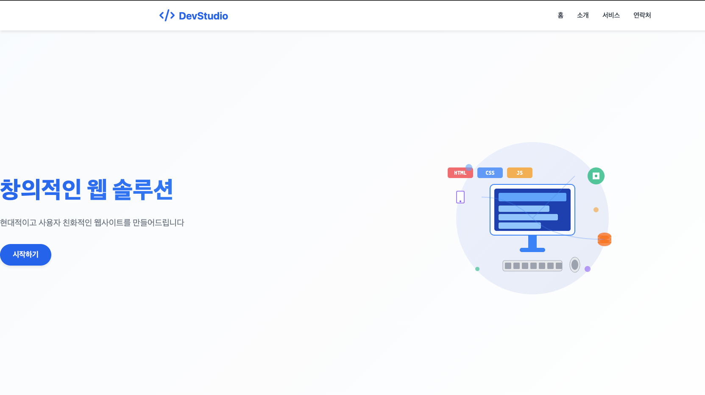

## 기본 웹페이지 배포하기(HTML,CSS,JS)

### **1. HTML, CSS, JS 웹 프로젝트를 EC2로 가져오기**

### **Git 설치 및 프로젝트 클론:**

```bash
*# nginx 웹 루트 디렉토리로 이동*
cd /usr/share/nginx

*# git 설치 (Amazon Linux/CentOS 기준)*
sudo yum install git

*# Ubuntu/Debian 계열인 경우:# sudo apt update && sudo apt install git# 설치 확인*
git --version
```

**프로젝트 클론:**

```bash
sudo git clone https://github.com/joung1010/nginx-basic-front.git
```

**클론 후 디렉토리 구조 확인:**

bash

```bash
ls -la /usr/share/nginx/
```

```bash
/usr/share/nginx/
├── html/                    *# 기본 nginx 파일들*
│   ├── index.html
│   └── 50x.html
└── nginx-basic-front/       *# 새로 클론된 프로젝트*
    ├── index.html
    ├── css/
    │   └── style.css
    ├── js/
    │   └── app.js
    └── images/
        └── logo.png
```

### **2. 설정 파일 수정하기**

**현재 설정 파일 위치 확인:**

```bash
*# 먼저 실제 설정 파일 구조 확인*
sudo nginx -t
ls -la /etc/nginx/conf.d/
```

### **Case A: default.conf가 존재하는 경우**

```bash
cd /etc/nginx/conf.d
sudo vi default.conf
```

### **Case B: default.conf가 없는 경우 (최신 Nginx)**

```bash
*# 새로운 설정 파일 생성*
sudo vi /etc/nginx/conf.d/mysite.conf

*# 또는 기존 nginx.conf의 server 블록 수정*
sudo vi /etc/nginx/nginx.conf
```

**설정 내용 수정:**

```bash
server {
    listen       80;
    server_name  localhost;

    *# 📂 프로젝트 루트 경로 변경*
    location / {
        root   /usr/share/nginx/nginx-basic-front;    *# 클론된 프로젝트 경로*
        index  index.html;
        
        *# 🔧 SPA나 React 앱인 경우 추가 설정*
        try_files $uri $uri/ /index.html;
    }
    
    *# 🚀 정적 파일 캐싱 최적화 (선택사항)*
    location ~* \.(css|js|png|jpg|jpeg|gif|ico|svg)$ {
        expires 1y;
        add_header Cache-Control "public, immutable";
        access_log off;  *# 정적 파일 로그 비활성화로 성능 향상*
    }

    *# 🚨 에러 페이지 설정*
    error_page   500 502 503 504  /50x.html;
    location = /50x.html {
        root   /usr/share/nginx/html;  *# 기본 에러 페이지는 원래 위치 유지*
    }
}
```

### **3. 설정 반영하기**


```bash
*# Nginx 설정 파일 중 문법 에러가 있는지 체크*
sudo nginx -t
```

**성공 시 출력:**

```bash
nginx: the configuration file /etc/nginx/nginx.conf syntax is ok
nginx: configuration file /etc/nginx/nginx.conf test is successful
```

**에러 시 출력 예시:**

```bash
nginx: [emerg] open() "/usr/share/nginx/nginx-basic-front/index.html" failed (2: No such file or directory) in /etc/nginx/conf.d/default.conf:12
```

```bash
*# Nginx의 설정 파일이 바뀐 경우 아래 명령어를 입력해줘야 설정 파일이 반영된다.*
sudo nginx -s reload
```

**reload 성공 확인:**

```bash
*# reload 후 프로세스 확인*
sudo systemctl status nginx

*# 또는 프로세스 ID 확인 (reload되면 worker 프로세스 ID가 변경됨)*
ps aux | grep nginx
```

### **5. 웹 페이지 접속해보기**

### **로컬에서 확인:**

```bash
*# curl로 HTML 내용 확인*
curl http://localhost/

*# HTTP 헤더 포함 확인*
curl -I http://localhost/

*# 특정 파일 확인*
curl http://localhost/css/style.css
curl http://localhost/js/app.js
```

### **브라우저 접속:**

```bash
*# EC2 인스턴스의 퍼블릭 IP 확인*
curl http://169.254.169.254/latest/meta-data/public-ipv4

*# 브라우저에서 접속: http://[EC2-PUBLIC-IP]/*
```

### **🔧 일반적인 배포 문제와 해결방법**

### **문제 1: 403 Forbidden**

```bash
*# 원인: 권한 문제# 해결:*
sudo chown -R nginx:nginx /usr/share/nginx/nginx-basic-front/
sudo chmod -R 755 /usr/share/nginx/nginx-basic-front/
```

### **문제 2: 404 Not Found**

```bash
*# 원인: 파일 경로 오타 또는 파일 부재# 해결: 실제 파일 존재 확인*
ls -la /usr/share/nginx/nginx-basic-front/index.html
```

### **문제 3: CSS/JS 파일이 로드되지 않음**

bash

```bash
*# 원인: MIME 타입 문제 또는 권한 문제# 해결: mime.types 포함 확인*
sudo nginx -T | grep "include.*mime.types"
```

### **💡 추가 최적화 설정**

**성능 향상을 위한 추가 설정:**

```bash
server {
    listen       80;
    server_name  localhost;

    location / {
        root   /usr/share/nginx/nginx-basic-front;
        index  index.html;
        try_files $uri $uri/ /index.html;  *# SPA 라우팅 지원*
    }
    
    *# 🚀 정적 파일 최적화*
    location ~* \.(css|js|png|jpg|jpeg|gif|ico|svg|woff|woff2|ttf|eot)$ {
        root   /usr/share/nginx/nginx-basic-front;
        expires 1y;                                    *# 1년 캐싱*
        add_header Cache-Control "public, immutable";   *# 브라우저 캐싱*
        access_log off;                                *# 로그 비활성화*
        
        *# Gzip 압축*
        gzip_static on;
    }
    
    *# 🔒 보안 헤더 추가*
    add_header X-Frame-Options "SAMEORIGIN" always;
    add_header X-Content-Type-Options "nosniff" always;
    add_header X-XSS-Protection "1; mode=block" always;
}
```


### 마지막 사이트 접속 해보기



### **2. React 프로젝트 빌드를 위해 Node.js 설치하기**

### **Amazon Linux 2023 기준 설치:**

```bash
*# 1. 시스템 업데이트*
sudo dnf update -y

*# 2. 기본 저장소에서 Node.js 설치 시도*
sudo dnf install nodejs npm -y

*# 3. 버전 확인*
node --version
npm --version
```

### **최신 Node.js 20 설치 (권장):**

```bash
*# 4. Node.js 20 LTS 설치*
curl -fsSL https://rpm.nodesource.com/setup_20.x | sudo bash -
sudo yum install -y nodejs

*# Node.js가 잘 설치됐는지 확인하기*
node -v
npm -v
```

**예상 출력:**

```bash
$ node -v
v20.11.1

$ npm -v  
10.2.4
```

### **Ubuntu/Debian 계열인 경우:**

```bash
curl -fsSL https://deb.nodesource.com/setup_20.x | sudo -E bash -
sudo apt-get install -y nodejs
```

### **3. React 프로젝트 빌드하기**

```bash
 $ cd nginx-basic-react
$ sudo npm i
$ sudo npm run build
```

### **🔧 빌드 과정 상세 분석**

**npm install 과정:**

```bash
*# package.json 확인*
cat package.json
```

```bash
{
  "name": "nginx-basic-react",
  "scripts": {
    "dev": "vite",
    "build": "vite build",
    "preview": "vite preview"
  },
  "dependencies": {
    "react": "^18.2.0",
    "react-dom": "^18.2.0"
  },
  "devDependencies": {
    "vite": "^5.0.0",
    "@vitejs/plugin-react": "^4.2.1"
  }
}
```

**빌드 실행:**

```bash
sudo npm run build
```

**빌드 성공 시 출력 예시:**

```bash
> nginx-basic-react@1.0.0 build
> vite build

✓ building for production...
✓ built in 1.23s
dist/
├── index.html
├── assets/
│   ├── index-[hash].js     *# 번들된 JavaScript*
│   └── index-[hash].css    *# 번들된 CSS*
└── favicon.ico
```

**⚠️ 중요:** Vite는 빌드 결과물을 **`dist`** 디렉토리에 생성하지만, Create React App은 **`build`** 디렉토리에 생성합니다!

**빌드 디렉토리 확인:**

```bash
ls -la /usr/share/nginx/nginx-basic-react/
```

**Vite 프로젝트라면:**

```bash
/usr/share/nginx/nginx-basic-react/
├── dist/           *# 👈 Vite 빌드 결과물*
│   ├── index.html
│   └── assets/
├── src/
└── package.json
```

### **4. Nginx 설정 파일 수정하기**

### **설정 파일 수정:**

```bash
cd /etc/nginx/conf.d
sudo vi default.conf

*# default.conf가 없다면:*
sudo vi /etc/nginx/conf.d/react-app.conf
```

### **Vite 프로젝트용 설정:**

```bash
server {
    listen       80; 
    server_name  localhost;

    *# 🔧 React 앱 루트 설정 (Vite는 dist 디렉토리 사용!)*
    location / {
        root   /usr/share/nginx/nginx-basic-react/dist;    *# Vite: dist 디렉토리*
        index  index.html;
        
        *# 🚀 SPA 라우팅 지원 (React Router용)*
        try_files $uri $uri/ /index.html;
    }
    
    *# 🎨 정적 에셋 최적화*
    location /assets/ {
        root   /usr/share/nginx/nginx-basic-react/dist;
        expires 1y;
        add_header Cache-Control "public, immutable";
        access_log off;
    }
    
    *# 🔒 보안 헤더 (React 앱용)*
    add_header X-Frame-Options "DENY" always;
    add_header X-Content-Type-Options "nosniff" always;
    add_header X-XSS-Protection "1; mode=block" always;
    add_header Referrer-Policy "strict-origin-when-cross-origin" always;

    *# 🚨 에러 페이지 설정*
    error_page   500 502 503 504  /50x.html;
    location = /50x.html {
        root   /usr/share/nginx/html;
    }
}
```

### **Create React App인 경우:**

```bash
location / {
    root   /usr/share/nginx/nginx-basic-react/build;    *# CRA: build 디렉토리*
    index  index.html;
    try_files $uri $uri/ /index.html;
}
```

### **5. 파일 권한 설정**

```bash
*# 빌드된 파일들의 권한 설정*
sudo chown -R nginx:nginx /usr/share/nginx/nginx-basic-react/dist/
sudo chmod -R 755 /usr/share/nginx/nginx-basic-react/dist/
```

### **6. 설정 반영하기**

```bash
*# Nginx 설정 파일 중 문법 에러가 있는지 체크*
sudo nginx -t

*# Nginx의 설정 파일이 바뀐 경우 아래 명령어를 입력해줘야 설정 파일이 반영된다.*
sudo nginx -s reload
```

### **7. 웹 페이지 접속해보기**

### **로컬 테스트:**

```bash
 *# HTML 내용 확인*
curl http://localhost/

*# React 앱의 정적 파일들 확인*
curl -I http://localhost/assets/index-*.js
curl -I http://localhost/assets/index-*.css
```

### **브라우저 접속:**

```bash
*# EC2 퍼블릭 IP 확인*
curl http://169.254.169.254/latest/meta-data/public-ipv4

*# 브라우저에서: http://[EC2-PUBLIC-IP]/*
```

## Next.js + Nginx 정적 배포하기

### **1. Next.js 프로젝트를 EC2로 가져오기**

```bash
cd /usr/share/nginx
sudo git clone https://github.com/joung1010/nginx-basic-nextjs.git
```

### **2. Next.js 프로젝트 빌드하기**

bash

```bash
$ cd nginx-basic-nextjs
$ sudo npm i
$ sudo npm run build
```

bash

### **⚠️ 중요: Next.js 정적 내보내기 설정**

**next.config.mjs**

```jsx
*/** @type {import('next').NextConfig} */*
const nextConfig = {
  output: 'export'    *// 정적 파일로 내보내기 활성화*
};

export default nextConfig;
```

**이 설정이 중요한 이유:**

- **기본 Next.js**: 서버 사이드 렌더링(SSR) 기반 → Node.js 서버 필요
- **output: 'export'**: 모든 페이지를 정적 HTML로 pre-render → Nginx만으로 배포 가능

**성공 시 출력 예시:**

bash

```jsx
> nginx-basic-nextjs@1.0.0 build
> next build

✓ Creating an optimized production build
✓ Compiled successfully
✓ Collecting page data
✓ Finalizing page optimization

Route (pages)                              Size     First Load JS
┌ ○ /                                      1.2 kB          87.2 kB
├ ○ /about                                 891 B           86.9 kB
└ ○ /404                                   194 B           86.1 kB

○  (Static)  automatically rendered as static HTML
```

### **3. Nginx 설정 파일 수정하기**

```bash
$ cd /etc/nginx/conf.d
$ sudo vi default.conf

*# default.conf가 없다면:*
$ sudo vi /etc/nginx/conf.d/nextjs-app.conf
```

### **Next.js 정적 배포용 Nginx 설정:**

```bash
server {
    listen       80; 
    server_name  localhost;

    *# 🚀 Next.js 정적 파일 서빙*
    location / {
        root   /usr/share/nginx/nginx-basic-nextjs/out;    *# Next.js는 out 디렉토리!*
        index  index.html;
        
        *# 🎯 SPA 라우팅 지원 (Next.js Router용)*
        try_files $uri $uri.html $uri/ /index.html;
    }
    
    *# 🚀 Next.js 정적 에셋 최적화*
    location /_next/static/ {
        root   /usr/share/nginx/nginx-basic-nextjs/out;
        expires 1y;
        add_header Cache-Control "public, immutable";
        access_log off;
    }
    
    *# 🖼️ 이미지 파일 최적화*
    location ~* \.(png|jpg|jpeg|gif|ico|svg|webp)$ {
        root   /usr/share/nginx/nginx-basic-nextjs/out;
        expires 1y;
        add_header Cache-Control "public, immutable";
        access_log off;
    }

    *# 🚨 에러 페이지 설정*
    error_page   500 502 503 504  /50x.html;
    location = /50x.html {
        root   /usr/share/nginx/html;
    }
}
```

### **3. Nginx 설정 파일 반영하기**

```bash
*# Nginx 설정 파일 중 문법 에러가 있는지 체크*
sudo nginx -t

*# Nginx의 설정 파일이 바뀐 경우 아래 명령어를 입력해줘야 설정 파일이 반영된다.*
sudo nginx -s reload
```

### **🔧 Next.js 특화 고급 설정**

### **API Routes 프록시 (풀스택 앱인 경우):**

```bash
server {
    listen 80;
    server_name localhost;
    
    *# 정적 파일 서빙*
    location / {
        root /usr/share/nginx/nginx-basic-nextjs/out;
        try_files $uri $uri.html $uri/ /index.html;
    }
    
    *# API Routes 프록시 (Node.js 서버 필요)*
    location /api/ {
        proxy_pass http://localhost:3000;  *# Next.js 서버*
        proxy_set_header Host $host;
        proxy_set_header X-Real-IP $remote_addr;
        proxy_set_header X-Forwarded-For $proxy_add_x_forwarded_for;
    }
}
```

### **성능 최적화 설정:**

```bash
server {
    listen 80;
    server_name localhost;
    
    *# Gzip 압축 활성화*
    gzip on;
    gzip_comp_level 6;
    gzip_types
        text/html
        text/css
        text/javascript
        application/javascript
        application/json;
    
    location / {
        root /usr/share/nginx/nginx-basic-nextjs/out;
        try_files $uri $uri.html $uri/ /index.html;
        
        *# 브라우저 캐싱 최적화*
        location ~* \.(html)$ {
            expires 1h;  *# HTML은 짧은 캐시*
            add_header Cache-Control "public, must-revalidate";
        }
        
        location ~* \.(css|js)$ {
            expires 1y;  *# CSS/JS는 긴 캐시*
            add_header Cache-Control "public, immutable";
        }
    }
}
```

### **💡 Next.js vs React 배포 차이점**

| 구분 | React (Vite) | React (CRA) | Next.js (Static) |
| --- | --- | --- | --- |
| **빌드 명령어** | `npm run build` | `npm run build` | `npm run build` |
| **결과 디렉토리** | `dist/` | `build/` | `out/` |
| **추가 설정** | 불필요 | 불필요 | `output: 'export'` 필수 |
| **라우팅 지원** | `try_files $uri $uri/ /index.html` | `try_files $uri $uri/ /index.html` | `try_files $uri $uri.html $uri/ /index.html` |