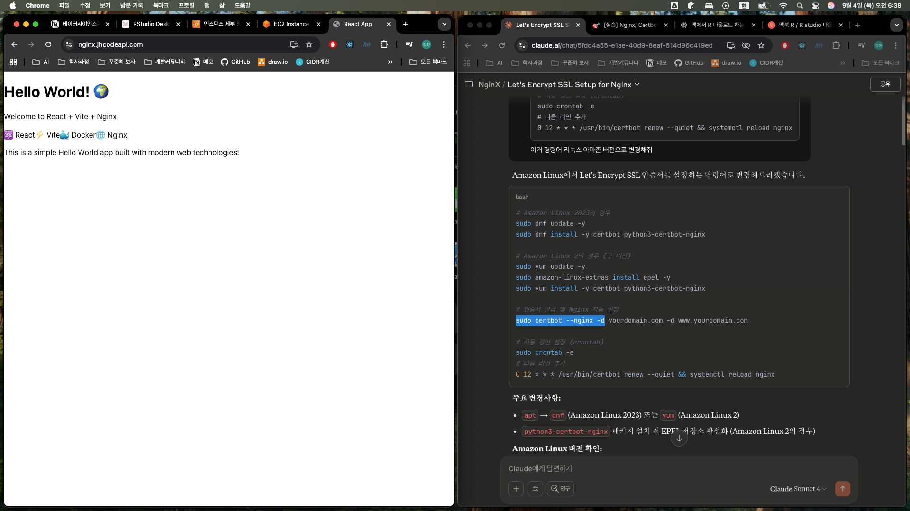

## 🛠️ 실무 구현 단계

### Step 1: SSL 인증서 준비

#### Let's Encrypt 무료 인증서 (권장)
```bash
# Certbot 설치
sudo apt update
sudo apt install certbot python3-certbot-nginx

# 인증서 발급 및 Nginx 자동 설정
sudo certbot --nginx -d yourdomain.com -d www.yourdomain.com
sudo certbot --nginx -d yourdomain.com

# 자동 갱신 설정 (crontab)
sudo crontab -e
# 다음 라인 추가
0 12 * * * /usr/bin/certbot renew --quiet && systemctl reload nginx
```


```bash
# Amazon Linux 2023의 경우
sudo dnf update -y
sudo dnf install -y certbot python3-certbot-nginx

# Amazon Linux 2의 경우 (구 버전)
sudo yum update -y
sudo amazon-linux-extras install epel -y
sudo yum install -y certbot python3-certbot-nginx

# 인증서 발급 및 Nginx 자동 설정 -d 도메인 명
sudo certbot --nginx -d yourdomain.com

# 자동 갱신 설정 (crontab)
sudo crontab -e
# 다음 라인 추가
0 12 * * * /usr/bin/certbot renew --quiet && systemctl reload nginx
```

확인
```bash
sudo certbot --nginx -d 도메인
```

브라우저에서 Https 확인하기  



#### 상용 인증서 사용 시
```bash
# 인증서 파일 위치
/etc/ssl/certs/yourdomain.com.crt      # 인증서
/etc/ssl/private/yourdomain.com.key    # 개인키
/etc/ssl/certs/ca-bundle.crt           # 중간 인증서
```

### Step 2: Nginx 설정 파일 구성

#### 기본 HTTPS 설정
```nginx
# HTTP → HTTPS 리다이렉트
server {
    listen 80;
    server_name yourdomain.com www.yourdomain.com;
    
    # HTTP 요청을 HTTPS로 영구 리다이렉트
    return 301 https://$server_name$request_uri;
}

# HTTPS 메인 서버 블록
server {
    listen 443 ssl http2;
    server_name yourdomain.com www.yourdomain.com;
    
    # SSL 인증서 경로
    ssl_certificate /etc/letsencrypt/live/yourdomain.com/fullchain.pem;
    ssl_certificate_key /etc/letsencrypt/live/yourdomain.com/privkey.pem;
    
    # SSL 보안 설정
    ssl_protocols TLSv1.2 TLSv1.3;
    ssl_ciphers ECDHE-ECDSA-AES128-GCM-SHA256:ECDHE-RSA-AES128-GCM-SHA256:ECDHE-ECDSA-AES256-GCM-SHA384:ECDHE-RSA-AES256-GCM-SHA384;
    ssl_prefer_server_ciphers off;
    
    # SSL 세션 설정
    ssl_session_cache shared:SSL:10m;
    ssl_session_timeout 10m;
    
    # 보안 헤더
    add_header Strict-Transport-Security "max-age=31536000; includeSubDomains; preload" always;
    add_header X-Frame-Options DENY always;
    add_header X-Content-Type-Options nosniff always;
    add_header X-XSS-Protection "1; mode=block" always;
    add_header Referrer-Policy "strict-origin-when-cross-origin" always;
    
    # Spring Boot 애플리케이션으로 프록시
    location / {
        proxy_pass http://localhost:8080;
        proxy_set_header Host $host;
        proxy_set_header X-Real-IP $remote_addr;
        proxy_set_header X-Forwarded-For $proxy_add_x_forwarded_for;
        proxy_set_header X-Forwarded-Proto $scheme;
        proxy_set_header X-Forwarded-Port $server_port;
        
        # 타임아웃 설정
        proxy_connect_timeout 30s;
        proxy_send_timeout 30s;
        proxy_read_timeout 30s;
    }
    
    # 정적 파일 최적화
    location ~* \.(css|js|png|jpg|jpeg|gif|ico|svg)$ {
        expires 1y;
        add_header Cache-Control "public, immutable";
        add_header Vary Accept-Encoding;
        gzip_static on;
    }
}
```

### Step 3: Spring Boot 설정 연동

#### application.yml 설정
```yaml
server:
  # Nginx에서 프록시된 헤더 인식
  forward-headers-strategy: framework
  port: 8080
  
# 보안 설정
spring:
  security:
    require-ssl: false  # Nginx에서 SSL 처리하므로 false
```

#### SecurityConfig.java (Spring Security 사용 시)
```java
@Configuration
@EnableWebSecurity
public class SecurityConfig {
    
    @Bean
    public SecurityFilterChain filterChain(HttpSecurity http) throws Exception {
        http
            // HTTPS 리다이렉트는 Nginx에서 처리
            .requiresChannel(channel -> 
                channel.requestMatchers(r -> r.getHeader("X-Forwarded-Proto") != null)
                       .requiresSecure())
            
            // 보안 헤더 (Nginx와 중복되지 않도록 선택적 설정)
            .headers(headers -> headers
                .frameOptions().deny()
                .contentTypeOptions().and()
                .httpStrictTransportSecurity(hsts -> hsts
                    .maxAgeInSeconds(31536000)
                    .includeSubdomains(true)
                    .preload(true)
                )
            );
            
        return http.build();
    }
}
```

---

## 🔧 고급 설정 및 최적화

### 1. **OCSP Stapling 설정**
```nginx
# SSL 성능 최적화
ssl_stapling on;
ssl_stapling_verify on;
ssl_trusted_certificate /etc/letsencrypt/live/yourdomain.com/chain.pem;
resolver 8.8.8.8 8.8.4.4 valid=300s;
resolver_timeout 5s;
```

### 2. **Gzip 압축 및 성능 최적화**
```nginx
# 압축 설정
gzip on;
gzip_vary on;
gzip_min_length 1024;
gzip_types
    text/plain
    text/css
    text/xml
    text/javascript
    application/javascript
    application/xml+rss
    application/json;
```

### 3. **보안 강화 설정**
```nginx
# 추가 보안 설정
server_tokens off;  # Nginx 버전 숨기기
add_header Content-Security-Policy "default-src 'self'; script-src 'self' 'unsafe-inline';" always;
add_header Permissions-Policy "camera=(), microphone=(), geolocation=()" always;
```

---

## 🚨 주의사항 및 트러블슈팅

### 1. **Mixed Content 문제 해결**
```html
<!-- 잘못된 예시 -->

<script src="http://cdn.example.com/script.js"></script>

<!-- 올바른 예시 -->

<script src="//cdn.example.com/script.js">  <!-- 프로토콜 상대 경로 -->
```

### 2. **Spring Boot에서 HTTPS URL 생성**
```java
@Controller
public class HomeController {
    
    @Value("${app.base-url}")
    private String baseUrl;
    
    @GetMapping("/")
    public String home(HttpServletRequest request, Model model) {
        // X-Forwarded-Proto 헤더로 HTTPS 여부 확인
        String protocol = request.getHeader("X-Forwarded-Proto");
        if (!"https".equals(protocol)) {
            // HTTPS로 리다이렉트 로직
        }
        return "index";
    }
}
```

### 3. **인증서 갱신 자동화**
```bash
#!/bin/bash
# /usr/local/bin/renew-ssl.sh

# 인증서 갱신
certbot renew --quiet

# Nginx 설정 테스트
nginx -t

# 성공 시 Nginx 재로드
if [ $? -eq 0 ]; then
    systemctl reload nginx
    echo "SSL certificate renewed and Nginx reloaded successfully"
else
    echo "Nginx configuration test failed"
    exit 1
fi
```

---

## 📊 성능 모니터링

### SSL Labs 테스트
- https://www.ssllabs.com/ssltest/ 에서 SSL 설정 검증
- A+ 등급을 목표로 설정 최적화

### 로그 분석
```nginx
# 상세 로그 설정
access_log /var/log/nginx/access.log combined;
error_log /var/log/nginx/error.log warn;

# SSL 관련 로그 포맷
log_format ssl_combined '$remote_addr - $remote_user [$time_local] '
                        '"$request" $status $body_bytes_sent '
                        '"$http_referer" "$http_user_agent" '
                        '$ssl_protocol/$ssl_cipher';
```

---

## 💡 개발 환경 vs 운영 환경

### 개발 환경
```bash
# 로컬 개발용 자체 서명 인증서
openssl req -x509 -nodes -days 365 -newkey rsa:2048 \
    -keyout /etc/ssl/private/selfsigned.key \
    -out /etc/ssl/certs/selfsigned.crt
```

### 운영 환경
- 반드시 신뢰할 수 있는 CA에서 발급받은 인증서 사용
- Let's Encrypt 또는 상용 SSL 인증서 권장
- 와일드카드 인증서 고려 (*.yourdomain.com)

---

## 🔍 검증 방법

1. **브라우저에서 확인**
    - 주소창에 자물쇠 아이콘 표시 확인
    - 인증서 정보 클릭하여 유효성 검증

2. **명령어로 확인**
   ```bash
   # SSL 인증서 정보 확인
   openssl s_client -connect yourdomain.com:443 -servername yourdomain.com
   
   # HTTP/2 지원 확인
   curl -I -H "Accept-Encoding: gzip" https://yourdomain.com
   ```

3. **자동화된 모니터링**
   ```bash
   # 인증서 만료일 확인 스크립트
   #!/bin/bash
   DOMAIN="yourdomain.com"
   EXPIRY_DATE=$(echo | openssl s_client -servername $DOMAIN -connect $DOMAIN:443 2>/dev/null | openssl x509 -noout -dates | grep notAfter | cut -d= -f2)
   echo "Certificate expires on: $EXPIRY_DATE"
   ```

이 가이드를 통해 안전하고 성능이 최적화된 HTTPS 환경을 구축할 수 있습니다. 특정 부분에 대해 더 자세한 설명이 필요하시거나 실제 구현 과정에서 문제가 발생하면 언제든 말씀해주세요!