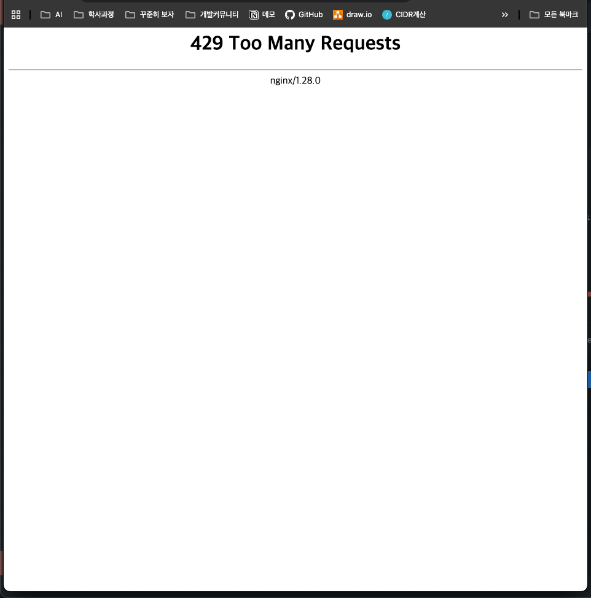

## 리버시 프록시 실습

### **1. Java 21 설치하기**

bash

```bash
*# 시스템 업데이트*
sudo dnf update -y

*# Java 21 설치*
sudo dnf install java-21-amazon-corretto-devel -y

*# 설치 확인*
java --version
javac --version

*# 환경변수 설정 (필요시)*
echo 'export JAVA_HOME=/usr/lib/jvm/java-21-amazon-corretto' >> ~/.bashrc
source ~/.bashrc
```

### **2. Git 프로젝트 가져오기**

```bash
*# 디렉토리로 이동*
cd /srv/app

*# 프로젝트 클론*
sudo git clone https://github.com/joung1010/Nginx.git

*# 권한 설정*
sudo chown -R ec2-user:ec2-user /srv/app/Nginx
cd Nginx
```

### **3. 프로젝트 구조 확인 및 빌드**

```bash
*# 프로젝트 구조 확인*
ls -la

*# Gradle Wrapper 실행 권한 부여*
chmod +x gradlew

*# 의존성 다운로드 및 빌드*
./gradlew clean build -x test

*# 빌드 결과 확인*
ls -la build/libs/
```

### **4. 애플리케이션 실행**

```bash
*# JAR 파일 실행 (백그라운드)*
nohup java -jar build/libs/nginx-0.0.1-SNAPSHOT.jar > app.log 2>&1 &

*# 또는 프로파일 지정해서 실행*
nohup java -jar -Dspring.profiles.active=prod build/libs/your-app-name.jar > app.log 2>&1 &

*# 실행 프로세스 확인*
ps aux | grep java

# 8080번 포트에서 실행되고 있는 프로세스 조회
lsof -i:8080
```

### **5. Nginx 설정하기**

```bash
cd /etc/nginx/conf.d/websites

*# Nginx 설정 파일 편집*
sudo vim api.jhcode.conf
```

**Nginx 설정 파일 내용:**

```bash
server {
				# api.jscode.p-e.kr:80로 들어온 요청을 이 server 블록이 처리
        listen 80;
        server_name api.jscode.p-e.kr;
        
        # / 으로 시작하는 모든 경로를 처리
        location / {
				        # 들어온 요청을 전부 http://localhost:8080(Spring Boot 서버)로 전달
                proxy_pass http://localhost:8080;
        }       
}
```

### **6. Nginx 재시작 및 확인**

```bash
### **6. Nginx 재시작 및 확인**

bash

sudo nginx -t

# Nginx 재시작*
sudo systemctl restart nginx

# 상태 확인*
sudo systemctl status nginx

# 포트 확인*
sudo netstat -tlnp | grep :80
sudo netstat -tlnp | grep :8080`
```

### 7.HTTPS  적용하기

```bash
sudo certbot --nginx -d yourdomain.com
```

### 8. 요청수 제한하기

리버스 프록시(Reverse Proxy) 서버의 역할은 **들어오는 요청**을 **관리**하고 **보안 처리**하는 것이라고 얘기했다. 대표적인 사용 예시가 **요청 수를 제한하는 것**이다. 요청 수를 제한함으로써 악의적인 반복 요청으로부터 서버를 보호할 수 있다.

1. **Nginx 설정 파일 수정**

   **/etc/nginx/conf.d/websites/api.jhcode.conf**


```bash
# limit_req_zone : 요청 수를 제한하기 위한 메모리 공간(zone)과 요청 속도(rate)를 정의
# $binary_remote_addr : 요청 수를 제한하는 기준을 클라이언트의 IP로 설정
# zone=mylimit:10m : 메모리 공간(zone)의 이름을 mylimit이라고 지정, 
                     메모리 공간의 크기를 10MB 제한 (약 16만개의 IP 주소를 관리할 수 있음)
# rate=3r/s : 1초에 최대 3개의 요청만 허용
**limit_req_zone $binary_remote_addr zone=mylimit:10m rate=3r/s;**

 server {
 				# limit_req_zone에서 정의한 mylimit이라는 조건을 이 server 블럭에 적용
        **limit_req zone=mylimit;**
        # 요청이 제한됐을 때 429(Too Many Requests) 상태 코드를 반환
        **limit_req_status 429;**
 
        server_name api.jhcodeapi.com;

        location / {
                proxy_pass http://localhost:8080;
        }

    listen 443 ssl; # managed by Certbot
    ssl_certificate /etc/letsencrypt/live/api.jhcodeapi.com/fullchain.pem; # managed by Certbot
    ssl_certificate_key /etc/letsencrypt/live/api.jhcodeapi.com/privkey.pem; # managed by Certbot
    include /etc/letsencrypt/options-ssl-nginx.conf; # managed by Certbot
    ssl_dhparam /etc/letsencrypt/ssl-dhparams.pem; # managed by Certbot

}
server {
    if ($host = api.jhcodeapi.com) {
        return 301 https://$host$request_uri;
    } # managed by Certbot

        listen 80;
        server_name api.jhcodeapi.com;
    return 404; # managed by Certbot

}
~    
```

### 9. 확인하기  
