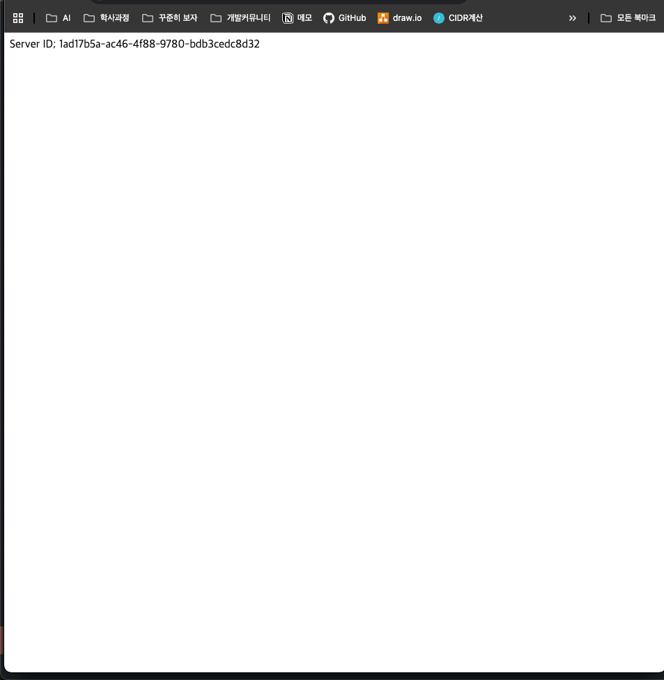
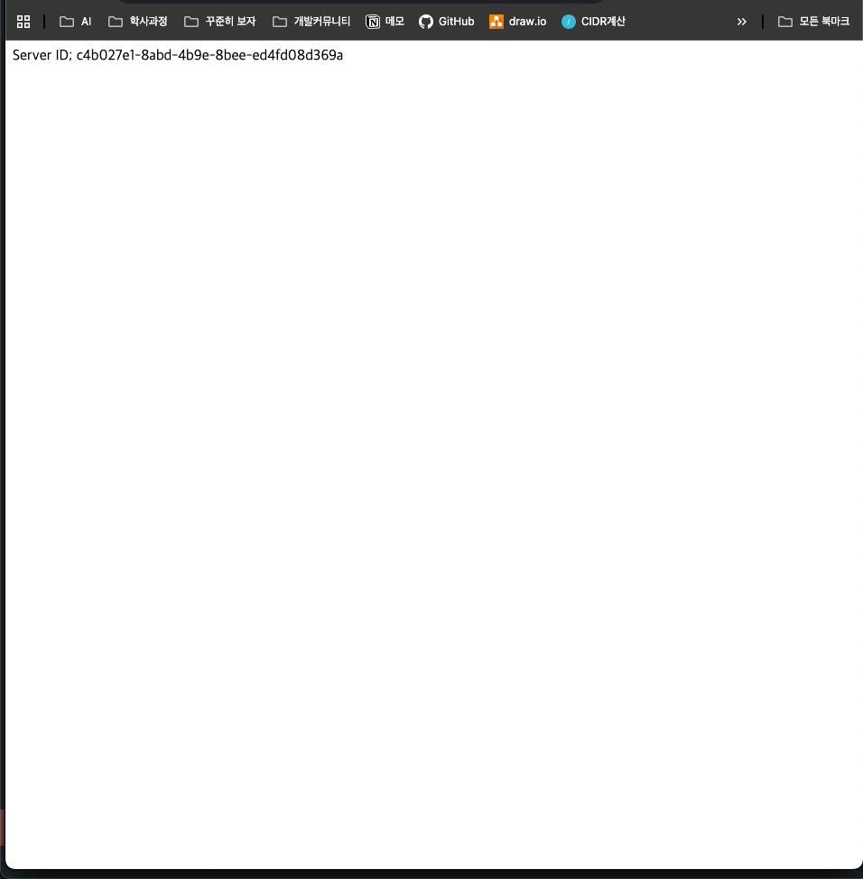

하나의 EC2에서 백엔드 서버 2개를 로드밸런싱 시키기

1. **EC2에 백엔드 서버(Spring Boot) 2개 띄우기**

   현재 8080번 포트에는 Spring Boot 서버를 이전에 실행시켜둔 상태이니, 8081번 포트에 추가적으로 Spring Boot를 띄울 수 있도록 하자.


```bash
cd /srv/app/Nginx/build/libs

nohup java -jar nginx-0.0.1-SNAPSHOT.jar --server.port=8081 > app2.log 2>&1 &

```

1. **8080번 포트, 8081번 포트에 Spring Boot 서버가 잘 띄워졌는 지 확인하기**

```bash
lsof -i:8080
lsof -i:8081
```

1. 설정 변경하기

```bash

limit_req_zone $binary_remote_addr zone=mylimit:10m rate=3r/s;**

# 로드 밸런싱 대상 서버들을 upstream이라는 그룹으로 묶음
# upstream 그룹의 이름은 backend라고 지정
**upstream backend {
        server localhost:8080;
        server localhost:8081;
}**

 server {
 				
        **limit_req zone=mylimit;**
        
        **limit_req_status 429;**
 
        server_name api.jhcodeapi.com;

        location / {
                proxy_pass **http://backend;**;
        }

    listen 443 ssl; # managed by Certbot
    ssl_certificate /etc/letsencrypt/live/api.jhcodeapi.com/fullchain.pem; # managed by Certbot
    ssl_certificate_key /etc/letsencrypt/live/api.jhcodeapi.com/privkey.pem; # managed by Certbot
    include /etc/letsencrypt/options-ssl-nginx.conf; # managed by Certbot
    ssl_dhparam /etc/letsencrypt/ssl-dhparams.pem; # managed by Certbot

}
server {
    if ($host = api.jhcodeapi.com) {
        return 301 https://$host$request_uri;
    } # managed by Certbot

        listen 80;
        server_name api.jhcodeapi.com;
    return 404; # managed by Certbot

}
```

### 확인하기
  
  
